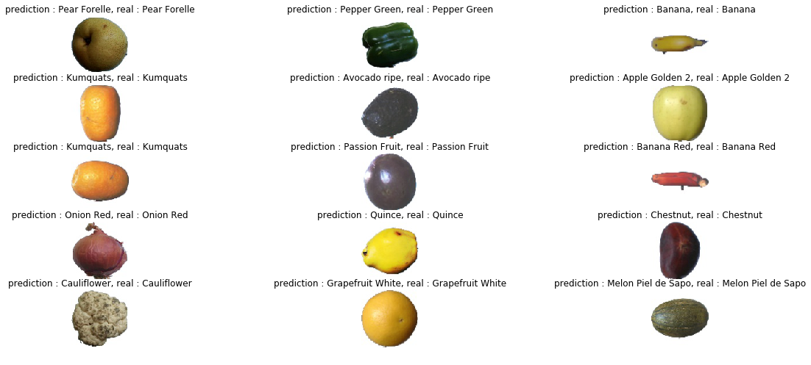
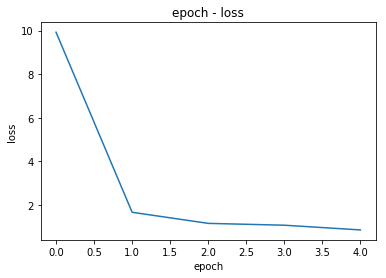

# fruit-vegetable-classification
Training a simple ConvNet to classify fruits and vegetables with PyTorch

[Dataset](https://www.kaggle.com/moltean/fruits) is available in kaggle.

In this dataset, there are 131 classes.


Install the required libraries
```bash
$ pip install -r requirements.txt
```

Then run the CNN.py file or run the CNN.ipynb file cell by cell.

```bash
$ python CNN.py
```

## Results
|  | 
|:--:| 
| classification results |

|  | 
|:--:| 
| epoch - Loss |

```bash
overall accuracy is 0.92
overall precision is 0.93
overall recall is 0.91
```
